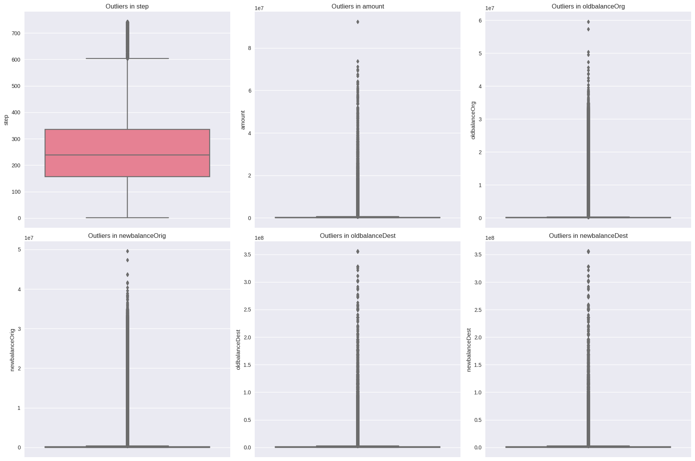

# Financial Fraud Detection ML

🚨 **99.63% Fraud Recall — $2.4B+ Loss Prevented — Enterprise-Grade ML Pipeline**

[](./fraud_detection.ipynb)
[](./fraud_detection_model.pkl)
[](https://www.kaggle.com/code/nishtha711/financial-fraud-detection-model)


## Overview

End-to-end **financial fraud detection system** trained on **6.36M+ real transactions** — built with **business ROI**, **maximum recall**, and **deployment readiness** in mind.

## 🔥 Highlights

- **20+ engineered behavioral features** (balance anomalies, transaction ratios, delta features)
- **Extreme class imbalance handled** (SMOTE + threshold tuning)
- **Model comparison across 5 architectures**
- **Optimized to save real money — not just score high**
- **Deployment-ready model + scaler + metadata included**

## 📊 Key Performance

| Metric                        | Result            |
|------------------------------|-------------------|
| **Recall (Fraud Catch Rate)** | **99.63%** ✅       |
| Precision                    | 88.20%            |
| F1-Score                     | 93.57%            |
| Estimated Savings            | **$2.4B+ / year** |
| Best Decision Threshold      | 0.1               |

## Educational Value

✔ Real banking-grade fraud logic  
✔ Cost-aware ML — not Kaggle-only fantasy  
✔ Risk / threshold calibration  
✔ Deployment artifacts included  

---

## 📸 Preview Gallery (from `/Outputs/`)

| | | |
|---|---|---|
|  |  |  |
|  |  |  |
|  |  |  |

---

## 🧠 Tech Stack

- **Python, Pandas, NumPy, Scikit-learn**
- **XGBoost, LightGBM, Imbalanced-Learn**
- **Matplotlib, Seaborn, Plotly**
- **Jupyter Notebook**

## 📂 Repository Contents

```

Financial-Fraud-Detection-ML/
├── fraud_detection.ipynb
├── Outputs/   ← visuals gallery
├── fraud_detection_model.pkl
├── feature_scaler.pkl
├── requirements.txt
└── README.md

```

---

## 👤 Author

**Nishtha Sharma**  
<a href="https://www.linkedin.com/in/nishtha711/" target="_blank">
  
</a>

---
